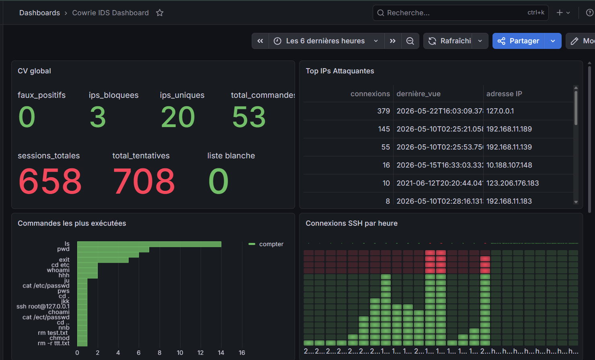
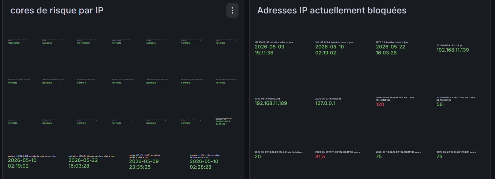
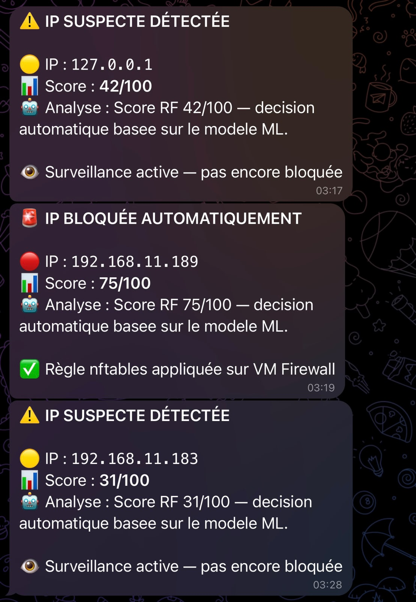
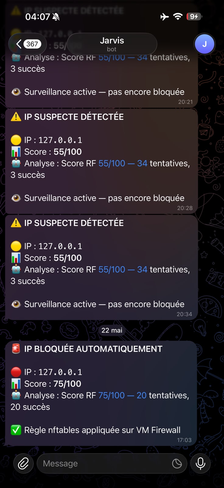
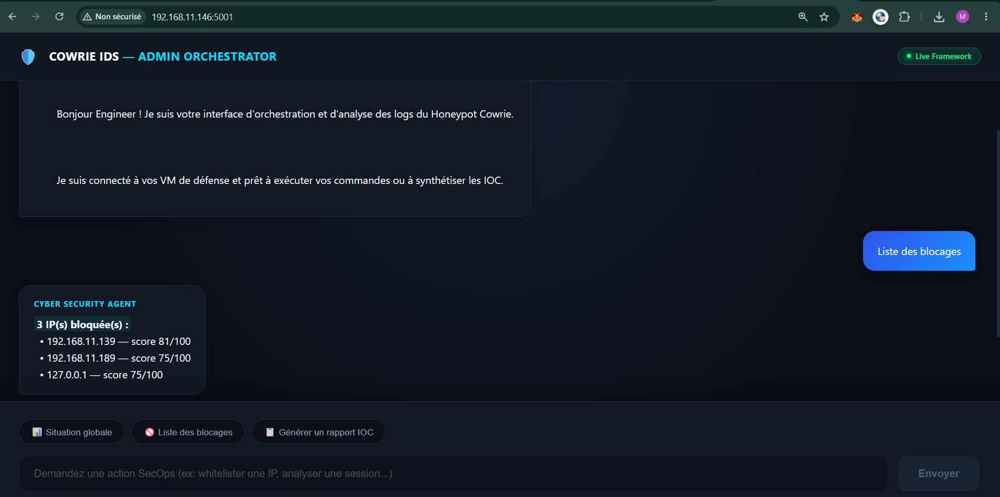
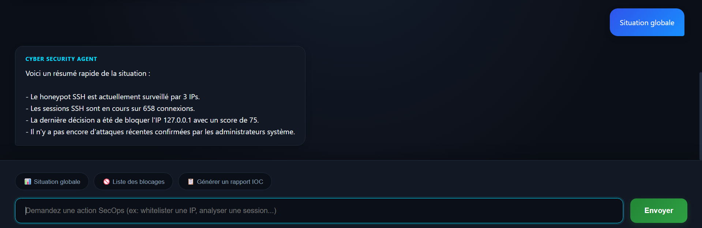

# 🍯 Honeypot Distribué Intelligent — IDS SSH avec IA

**Projet de Fin de Module — Gestion des Intrusions** **EMSI Casablanca — 4ème année Cybersécurité & Infrastructures Réseaux (4CIRA G2)** **Auteurs : Anibar Taha & Mahamat Emma Aboubakar | Encadrant : Pr. Ennaji Mohammed | 2025-2026**

---

## 📌 Description

Infrastructure complète de détection et de prévention d'intrusions SSH combinant un honeypot Cowrie, une persistance MongoDB, un double module d'Intelligence Artificielle (Scoring via Machine Learning Random Forest + contextualisation métier via un LLM local), et une stack de supervision Grafana couplée à des alertes de remédiations instantanées.

Le système capture à la volée les flux SSH compromis, extrait les features comportementales clés, calcule un niveau de criticité dynamique, applique des politiques de blocage fermes via nftables sur notre passerelle pare-feu dédiée et notifie l'équipe de sécurité en temps réel.

---

## 🏗️ Architecture Technique

```text
Internet / VM Kali (Attaquant)
         ↓
VM Firewall (nftables + API REST Python :5002)
         ↓ DNAT Règle : Port 22 → Cowrie Port 2222
VM Cowrie (Honeypot + Stack Analytique Interne)
├── Cowrie SSH Honeypot      :2222
├── MongoDB 7.0 (Persistance) :27017
├── Module IA Daemon         (systemd Core Unit)
│   ├── Random Forest Classifier (model.pkl)
│   └── LLM Local Llama3.2 1B    (Ollama Engine)
├── API Grafana (Flask Bridge) :5000
├── Admin Chat LLM Interface :5001
└── Grafana Dashboard Visual :3000
         ↓
Telegram Bot API (Alerte instantanée sur détection d'anomalies de criticité haute)
```

## 🛠️ Stack Technologique

| Composant | Technologie | Rôle Fonctionnel |
|-----------|-------------|------------------|
| **Honeypot Core** | Cowrie 2.x (Git Stack) | Émulation SSH interactive, capture de TTY logs |
| **Persistence Layer** | MongoDB 7.0 | Entreposage structuré des logs bruts & métriques de l'IA |
| **Machine Learning** | Scikit-Learn Random Forest | Classification binaire et calcul du score de risque [0-100] |
| **Local LLM Orchestrator** | Ollama Engine + Llama3.2 1B | Génération automatisée des analyses de décisions en français |
| **Data Visualization** | Grafana 10.x Stack | Tableaux de bord de supervision cyber en temps réel |
| **Application Layer** | Flask Python REST API | Passerelle de routage de données MongoDB → Grafana |
| **Interactive Shell** | Flask + Ollama API | Console d'administration en langage naturel (Chatbot) |
| **Instant Alerting** | Telegram Bot Platform | Notification de blocage de vecteurs d'attaques aux admins |
| **Packet Filtering** | Nftables Engine (VM Dédiée) | Isolation logique et bannissement IP temps réel |
| **Overlay Network** | ZeroTier Mesh | Tunneling chiffré et interconnexion des VMs d'infrastructure |

## 📊 Principales Fonctionnalités

* **Capture & Analyse Passive :** Réception transparente des flux SSH (Sessions, Authentifications, Saisie de commandes, Flux binaires).
* **Évaluation Cognitive (ML) :** Traitement analytique périodique (toutes les 30 secondes) des sessions suspectes par Random Forest.
* **Interprétation Humaine (LLM) :** Traduction des arbres de décision mathématiques en explications textuelles exploitables par un opérateur SOC.
* **Mitigation Active :** Bannissement dynamique sur le pare-feu dès qu'une IP franchit le seuil critique de score `> 70/100`.
* **Interface Conversationnelle :** Gestion simplifiée de l'infrastructure via Chat (Whitelisting, levée de faux positifs, états du système).


## 🗂️ Structure du Répertoire Git

```text
honeypot-intelligent-ids/
├── cowrie/
│   └── cowrie.cfg              ← Configuration et durcissement du honeypot
├── grafana/
│   └── cowrie-ids-dashboard.json ← Configuration exportée du dashboard (Dashboard-as-Code)
├── ia/
│   ├── daemon.py               ← Boucle d'analyse daemonisée (30s)
│   ├── features.py             ← Pipeline d'extraction des métriques MongoDB
│   ├── scorer.py               ← Moteur d'inférence Random Forest
│   ├── llm.py                  ← Intégration Ollama & Prompt Engineering
│   ├── telegram_alert.py       ← Notifications push SecOps
│   ├── train_model.py          ← Script de réentraînement du modèle prédictif
│   └── generate_dataset.py     ← Script synthétique de labellisation de données
├── scripts/
│   ├── grafana_api.py          ← Endpoint d'alimentation Grafana (:5000)
│   ├── chat.py                 ← Backend de la console conversationnelle (:5001)
│   ├── firewall_api.py         ← API d'écoute sur la VM de filtrage (:5002)
│   └── ioc_extractor.py        ← Générateur automatique de rapports d'IOCs
├── samples/
│   ├── cowrie_sample.json      ← Données brutes de sessions anonymisées
│   └── ioc_report.json         ← Rapport d'indicateurs de compromission final
└── docs/
    ├── .gitignore              ← Exclusion des logs locaux et variables d'environnement
    ├── ia_logs_sample.txt      ← Échantillon des sorties d'analyse IA
    ├── mongodb_schema.md       ← Spécifications détaillées des collections
    └── screenshots/            ← Preuves d'exécution et de validation visuelle

```
## 📈 Métriques d'Exploitation Réelles

*Consulter directement `/samples/ioc_report.json` pour obtenir l'état volumétrique à jour.*

* **Précision Algorithmique (Random Forest) :** `99.9%` (F1-Score mesuré en environnement de test contrôlé).
* **Latence de Traitement (Infection → Règle Firewall) :** `~50 secondes` au maximum (Temps d'échantillonnage + calculs itératifs inclus).


## 📸 Captures d'Écran (Validation SOC)

### 1. Vue d'ensemble du Dashboard Grafana

### 2. Suivi des Risques IA et États de Blocage

### 3. Alertes de remédiation en temps réel sur Telegram



### 4. Interface de discussion administrateur (LLM)



